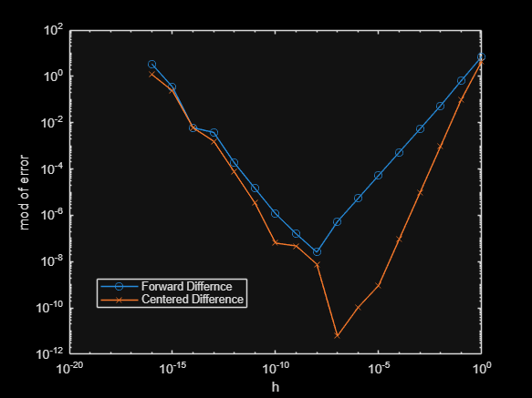
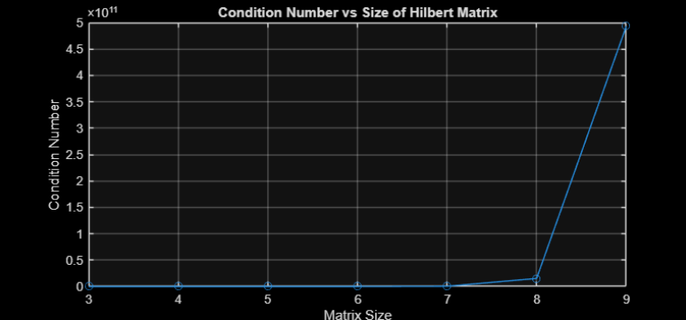
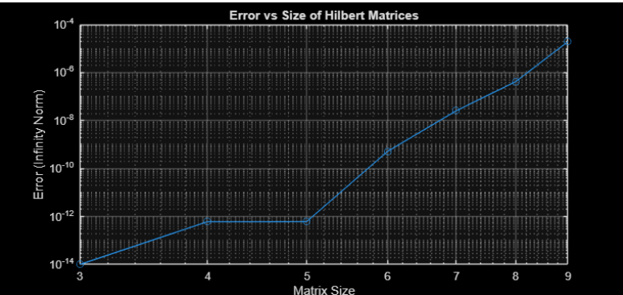
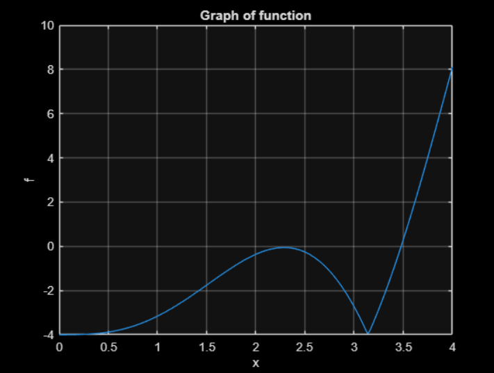
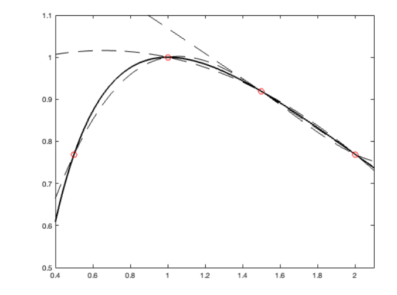
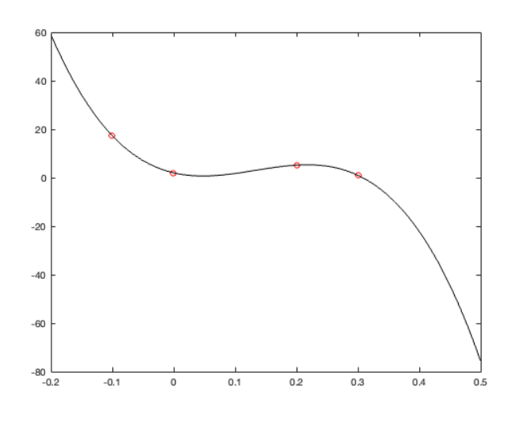

# Numerical Computing Toolkit

<p align="center">

**A collection of numerical algorithms implemented from scratch in Python and MATLAB, covering floating-point arithmetic, numerical linear algebra, nonlinear equation solving, interpolation, and numerical integration.**

</p>

---

## Overview

Numerical methods form the backbone of scientific computing, enabling accurate solutions to problems where analytical solutions are difficult or impossible to obtain.

This project implements classical numerical algorithms from first principles and investigates their numerical stability, convergence properties, conditioning and approximation accuracy through computational experiments.

Rather than relying on built-in numerical libraries, each algorithm is implemented manually to better understand the mathematics governing scientific computation.

---

## Project Highlights

- Floating-point number systems and machine precision
- Round-off and truncation error analysis
- Matrix conditioning and numerical stability
- Direct and iterative linear system solvers
- Nonlinear root-finding algorithms
- Newton methods for systems of equations
- Polynomial interpolation
- Natural cubic splines
- Numerical integration using Gaussian quadrature

---

# Results

One of the primary goals of this project was not only implementing algorithms but also visualizing their numerical behaviour.

<p align="center">


</p>

<p align="center">
<i>Finite difference error analysis (left) and conditioning behaviour of Hilbert matrices (right).</i>
</p>

---

# Modules

## Floating Point Arithmetic

Implementation of floating-point number systems, machine precision analysis, underflow, overflow and representable numbers.

---

## Numerical Error Analysis

Investigates the trade-off between truncation error and round-off error for finite difference approximations.

<p align="center">

</p>

Key ideas:

- Forward Difference
- Centered Difference
- Machine Precision
- Optimal Step Size

---

## Matrix Conditioning

Investigates numerical stability using Hilbert, Vandermonde and Tridiagonal matrices.

<p align="center">


</p>

Topics covered:

- Condition Numbers
- Ill-conditioned matrices
- Numerical Stability

---

## Linear System Solvers

Algorithms implemented from scratch:

- Gaussian Elimination
- Partial Pivoting
- Scaled Partial Pivoting
- Error Analysis

---

## Iterative Solvers

Implemented iterative algorithms for solving sparse linear systems.

- Jacobi Method
- Gauss-Seidel Method

Comparison includes convergence rate and iteration count.

---

## Root Finding

Implemented several classical nonlinear equation solvers.

<p align="center">

</p>

Algorithms:

- Bisection
- Fixed Point Iteration
- Secant Method
- Newton-Raphson

---

## Newton Methods

Implemented Newton methods for

- Single-variable nonlinear equations
- Systems of nonlinear equations

Demonstrates quadratic convergence under appropriate assumptions.

---

## Interpolation

Approximation of functions using polynomial interpolation and splines.

<p align="center">

</p>

Implemented:

- Newton Divided Differences
- Lagrange Interpolation
- Natural Cubic Splines

---

## Numerical Integration

Comparison of high-order quadrature techniques.

<p align="center">

</p>

Methods:

- Clenshaw–Curtis Quadrature
- Gauss–Legendre Quadrature

Includes error analysis and degree-of-exactness experiments.

---

# Algorithms Implemented

| Area | Algorithms |
|------|------------|
| Floating Point | Machine Precision, Floating Point Representation |
| Error Analysis | Forward Difference, Centered Difference |
| Linear Algebra | Gaussian Elimination, Partial Pivoting, Scaled Pivoting |
| Iterative Methods | Jacobi, Gauss-Seidel |
| Root Finding | Bisection, Fixed Point, Secant, Newton-Raphson |
| Nonlinear Systems | Newton Method |
| Interpolation | Newton Polynomial, Lagrange, Cubic Splines |
| Numerical Integration | Clenshaw–Curtis, Gauss–Legendre |

---
## Repository Structure

```text
numerical-computing-toolkit/
│
├── notebooks/
│   ├── floating_point_arithmetic.ipynb
│   ├── numerical_error_analysis.ipynb
│   ├── matrix_conditioning_analysis.ipynb
│   ├── direct_linear_system_solvers.ipynb
│   ├── iterative_linear_solvers.ipynb
│   ├── root_finding_methods.ipynb
│   ├── newton_methods.ipynb
│   └── interpolation_and_splines.ipynb
│
├── assets/
│   └── images/
│       ├── error-analysis.png
│       ├── hilbert-error.png
│       ├── hilbert-conditioning.png
│       ├── root-finding-function.png
│       ├── interpolation-polynomials.png
│       └── divided-difference.png
│
└── README.md
```
